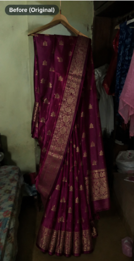
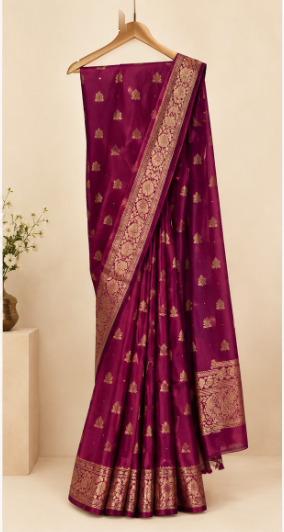

# 🪔 SHILP-AI (शिल्प-AI)
### *From Traditional Craft to Global Commerce — Powered by Autonomous AI*

[](https://reactjs.org/)
[](https://www.typescriptlang.org/)
[](https://vitejs.dev/)
[](https://tailwindcss.com/)
[](https://supabase.com/)
[](https://ai.google.dev/)
[](https://www.sarvam.ai/)

---

## 📌 What is Shilp-AI?

**Shilp-AI** is an autonomous **"Virtual Business Manager"** designed specifically for traditional Indian artisans, handloom weavers, potters, and rural micro-entrepreneurs. 

India is home to over 7 million traditional artisans producing exquisite handicrafts (Banarasi silk, Terracotta, Madhubani art, Dhokra brass, Blue Pottery, etc.). However, they face significant barriers in reaching modern e-commerce markets:
1. **Low Digital Literacy & Language Barriers**: Rural artisans often cannot navigate complicated, English-centric e-commerce seller portals.
2. **Poor Product Photography**: Photos taken inside dimly-lit, cluttered village workshops get rejected by major e-commerce platforms.
3. **Exploitative Middlemen**: Lacking market visibility, artisans frequently sell authentic handmade heritage items for a fraction of their worth to brokers and middlemen.

**Shilp-AI solves this end-to-end**: An artisan simply snaps a photo and speaks in their mother tongue (Hindi, English, Telugu, Tamil, Bengali, Marathi, etc.). The AI automatically enhances the photograph into a studio-grade e-commerce listing, extracts craft details, calculates fair-wage pricing, generates an AI bio, and publishes the product to global buyers and B2B marketplaces.

---

## 🔐 Key Updates & Authentication Features (`authentication_fix`)

* **21 Sarvam AI Languages**: First-launch language selection with 21 supported Indian languages and persistent session preferences.
* **Dual Authentication Flow**:
  * **Create Account**: Phone number + Vonage OTP verification for both Artisans and Buyers.
  * **Existing Account Login**: Phone number / Username + Password authentication via Supabase Auth.
* **Deterministic Verification Tier Logic**:
  * 🟢 **Identity Verified**: Government ID (Aadhaar / Voter ID / PAN) submitted.
  * 🟣 **GI Craft Verified / Certified Artisan**: Artisan Certificate (GI Tag / MoSJE Letter) submitted.
  * 🟣 **Certified Artisan**: Both Government ID and Artisan Certificate submitted.
* **1-to-1 Buyer ↔ Artisan Messaging**: Direct messaging system connected to Supabase Realtime with participant RLS security policies.
* **Google Gemini AI Integration**: Generates artisan bio profiles and powers ShilpSaathi AI Copilot.

---

## 🖼️ Before & After Photographic Enhancement (100% Authentic Product)

The core principle of Shilp-AI's Computer Vision studio is **Photo Editing Only — Zero Regeneration**:

> **"The product remains 100% identical to the real physical craft — same saree, exact colors, patterns, embroidery, texture, folds, shape, size, and position. We never regenerate, redraw, recolor, or distort the artisan's genuine work."**

| 📷 Before (Original Workshop Photo) | ✨ After (Professional Studio Edit) |
| :---: | :---: |
|  |  |
| *Dim room, cluttered bed, dark wardrobe, murky shadows* | *100% identical saree, clean studio backdrop, lifted exposure & zari radiance* |

---

## 🛠️ Tech Stack

| Layer | Technology | Purpose |
| :--- | :--- | :--- |
| **Frontend Framework** | **React 18** + **TypeScript** | High-performance, type-safe UI architecture |
| **Styling & Design** | **Tailwind CSS 3.4** | Modern, warm minimal aesthetic (`#FAF8F5` cream palette) |
| **Bundler & Dev Server**| **Vite 6** | Instant Hot Module Replacement (HMR) and optimized builds |
| **Backend & Auth** | **Supabase (PostgreSQL & Storage)** | Authentication, RLS policies, storage buckets, and Realtime messaging |
| **AI Bio & Copilot** | **Google Gemini 2.0 API** | AI-generated artisan bio profiles & ShilpSaathi assistant |
| **Multilingual Engine** | **Sarvam AI** | 21 Indian languages translation & localization |
| **Computer Vision** | **@imgly/background-removal** | In-browser WebAssembly / WebGPU neural foreground segmentation |
| **Mobile Runtime** | **Capacitor 8** | Native Android container with camera and hardware access |

---

## 🚀 Getting Started (Run Locally)

### Prerequisites
* **Node.js**: `v18.0.0` or higher
* **npm**: `v9.0.0` or higher

### Installation & Launch

1. **Clone the Repository**:
   ```bash
   git clone https://github.com/ManjusreeSedamkar/Shilp-AI.git
   cd Shilp-AI
   ```

2. **Checkout Branch**:
   ```bash
   git checkout authentication_fix
   ```

3. **Install Dependencies**:
   ```bash
   npm install
   ```

4. **Environment Variables**:
   Create a `.env` file in the root directory:
   ```env
   VITE_SUPABASE_URL=https://your-project.supabase.co
   VITE_SUPABASE_ANON_KEY=your-anon-key
   VITE_GEMINI_API_KEY=your-gemini-api-key
   ```

5. **Start the Development Server**:
   ```bash
   npm run dev
   ```

6. **Build for Production**:
   ```bash
   npm run build
   ```

---

## 🤝 Contributing & License

Released under the **MIT License**. Contributions to support rural Indian craftspeople are welcome!
